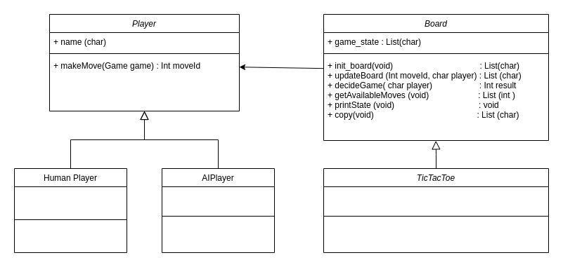
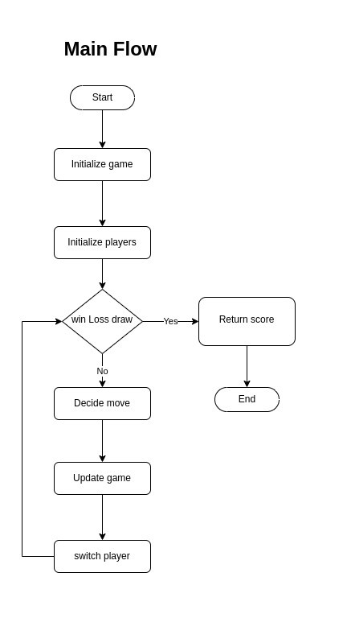
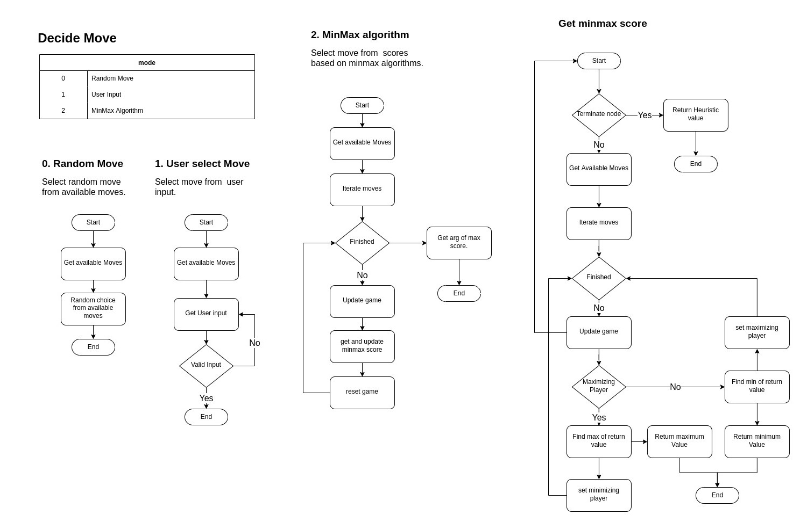

# Two Player Games

This repository contains the two player games implementation with multiple programming languages.

Currently supported game:
- TicTacToe

Currently supported languages:
- C
- Python

Currently supported Automation (AI):
- mode 0: Random move
- mode 1. User Input
- mode 2. MinMax Algorithm.
- mode 3. MinMax Alpha Beta Algorithm.


## Running with python runtime

### Step 1. Enter `Python` Directory

```console
cd Python
```

### Step 2. Run `main.py` with python interpreter.
```console
python main.py
```


## Running with C runtime

### Step 1. Enter `C` Directory
```console
cd C
```

### Step 2: Compile main file with `make` command
```console
make
```
This will output `main` executable file.

### Step 3: Run executable file.

```console
./main
```

Option: If you want to delete all the Object file `*.o` files and the executable file, enter below command to clean all the files.
```console
make clean
```


## File/Code structure, Pseudo Code and Flowchart.

For languages that is capable of OOP, we will use OOP, if not, we will use just Functional programming.
For OOP, see the below UMI.



See file dependencies for `C` in [Makefile](C/Makefile).
```C
main.c
    |_ + int main();
utils.h
    |_ + int min(int a, int b);
    |_ + int max(int a, int b);
    |_ + int argmax(int a[], int len_a);
    |_ + int check_input_valid(int available_moves[], int total_available_moves, int move_id_);
players.h
    |_ + int random_move(char game_state[9], char player);
    |_ + int user_move(char game_state[9], char player);
    |_ + int minmax(char game_state[9], int maximize);
    |_ + int minmax_alpha_beta(char game_state[9], int maximize, int alpha, int beta);
    |_ + int *get_minmax_score(char game_state[9], char player);
    |_ + int minmax_move(char game_state[9], char player);
    |_ + int make_move(char game_state[9], char player, int mode);
board.h
    |_ + char *init_board();
    |_ + void update_game(char game_state[9], int move_id, char player);
    |_ + int decide_game(char game_state[], char player);
    |_ + int *get_available_moves(char game_state[9]);
    |_ + int get_total_available_moves(char game_state[9]);
    |_ + void print_game_state(char game_state[9]);
    |_ + void print_available_moves(int available_moves[], int total_available_moves);
    |_ + char *copy_board(char game_state[9]);
```


Pseudo Code for `main` function
```python
function main() is
    * initialize game board *
    * initialize players *
    select current player
    while not win or draw then
        current player decide move based on game state
        update game board with new move
        if win then
            return score for player
        if draw then
            return 0
        switch current player
```
Flow chart for `main` function



## MinMax Algorithm

Pseudo code for `MinMax` algorithm.
Reference from [Wiki](https://en.wikipedia.org/wiki/Minimax).
```python
function  minimax(node, maximizingPlayer) is
    if node is a terminal node then
        return the heuristic value of node
    if maximizingPlayer then
        value := −∞
        for each child of node do
            value := max(value, minimax(child, FALSE))
        return value
    else (* minimizing player *)
        value := +∞
        for each child of node do
            value := min(value, minimax(child, TRUE))
        return value
```

Pseudo code for `MinMax with Alpha Beta Pruning`. Reference from [GeeksforGeeks](https://www.geeksforgeeks.org/minimax-algorithm-in-game-theory-set-4-alpha-beta-pruning/)
```python
function minimax_alpha_beta(node, depth, isMaximizingPlayer, alpha, beta):
    if node is a leaf node :
        return value of the node
    
    if isMaximizingPlayer :
        bestVal = -INFINITY 
        for each child node :
            value = minimax(node, depth+1, false, alpha, beta)
            bestVal = max( bestVal, value) 
            alpha = max( alpha, bestVal)
            if beta <= alpha:
                break
        return bestVal

    else :
        bestVal = +INFINITY 
        for each child node :
            value = minimax(node, depth+1, true, alpha, beta)
            bestVal = min( bestVal, value) 
            beta = min( beta, bestVal)
            if beta <= alpha:
                break
        return bestVal
```


Flow chart for `make move`


